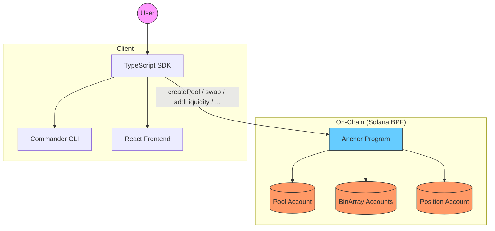
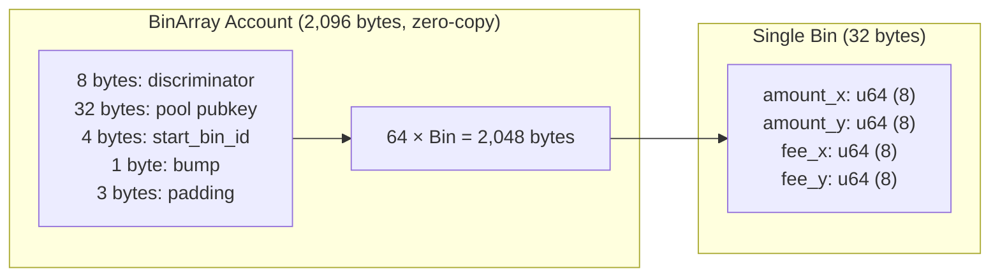
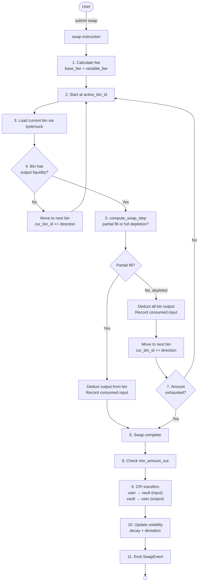
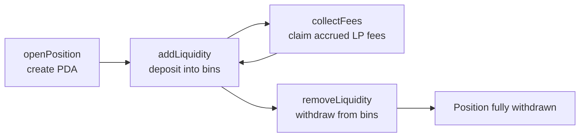

# DLMM — Dynamic Liquidity Market Maker on Solana

A production-style bin-based concentrated-liquidity AMM built on Solana
using the Anchor framework. Inspired by Trader Joe's Liquidity Book v2.



## Architecture

The protocol divides price space into discrete **bins** at fixed intervals.
Each bin represents a specific price point. Liquidity providers concentrate
liquidity within a range of bins, and swaps traverse bins sequentially.

```
Pool (1 per pair)
┌──────────────────────────────────────┐
│  token_mint_a, token_mint_b          │
│  token_vault_a, token_vault_b        │
│  bin_step_bps, active_bin_id         │
│  base_fee_bps, variable_fee_bps      │
│  vol_reference_price, vol_accumulator│
└──────────────────────────────────────┘
         │
         │  has many
         ▼
BinArray (1 per 64-bin range, zero-copy)     Position (1 per user per pool)
┌──────────────────────────┐                 ┌──────────────────────────┐
│  pool, start_bin_id      │                 │  owner, pool             │
│  ┌──────┐                │                 │  lower_bin, upper_bin    │
│  │ Bin 0 │ amount_x/y   │                 │  total_liquidity_x/y     │
│  │ Bin 1 │ fee_x/y      │ 64 bins         │  fee_checkpoint_x/y      │
│  │ ...   │              │                 │  fees_owed_x/y           │
│  │ Bin 63│              │                 └──────────────────────────┘
│  └──────┘                │
└──────────────────────────┘
```

## BinArray Layout



Each `BinArray` covers 64 consecutive bins. Multiple BinArrays form a
contiguous price range. The `#[account(zero_copy)]` attribute enables
direct memory mapping via `bytemuck::from_bytes_mut`, eliminating Borsh
serialization overhead on every swap operation.

## Swap Flow



## Position Lifecycle



## Instructions

| Instruction | Description | Key Accounts |
|-------------|-------------|-------------|
| `initialize_pool` | Create a pool | Pool PDA, token mints, vaults |
| `initialize_bin_array` | Create a BinArray PDA | BinArray PDA, Pool |
| `open_position` | Open a position | Position PDA, Pool |
| `add_liquidity` | Deposit into bins | Position, Pool, BinArrays, Token vaults |
| `remove_liquidity` | Withdraw from bins | Position, Pool, BinArrays, Token vaults |
| `swap` | Execute ExactIn/ExactOut swap | Pool, Token vaults, BinArrays |
| `collect_fees` | Claim LP fees | Position, Pool, BinArrays, Token vaults |

## Key Design Decisions

| Decision | Choice |
|----------|--------|
| Price math | Q64.64 fixed-point, binary exponentiation (O(log n)) |
| Bin storage | Zero-copy account (`#[account(zero_copy)]`, bytemuck) |
| Bins per array | 64 (2,096 bytes per account) |
| Fee model | Dynamic: base + variable (volatility-driven, 0-200 bps) |
| LP representation | Non-fungible Position accounts (no SPL LP token) |
| q64_mul | Limb-based widening multiply (avoids u128 overflow) |
| Negative bin prices | `inv_base_multiplier` (avoids Q64² overflow) |

## Performance

| Metric | Value |
|--------|-------|
| `q64_mul` | **416 ns** (x86_64 host) |
| `bin_to_price` (bin=100) | **4.2 µs** |
| `swap_step` (partial) | **221 ns** |
| 100-bin swap (projected) | **~69 µs** (x86_64), **~1.4 ms** (SBF est.) |
| Pool account | 201 bytes |
| BinArray account | 2,096 bytes |
| Position account | 145 bytes |

See [PERFORMANCE.md](./PERFORMANCE.md) for full benchmark data.

## Tests

```
95 Rust unit tests  (math, state, swap, fee, invariants)
22 TypeScript tests (10 property + 11 fuzz + 1 integration)
```

See [INVARIANTS.md](./INVARIANTS.md) for formal system invariants.

## Quick Start

```bash
# Rust tests
RUSTC_BOOTSTRAP=1 cargo +nightly test

# Benchmarks
RUSTC_BOOTSTRAP=1 cargo +nightly bench -p dlmm

# TypeScript tests
npm install && npx mocha --require ts-node/register tests/dlmm.spec.ts

# CLI
cd cli && npm install && npx ts-node src/index.ts --help
```

## CLI

```bash
dlmm create-pool --mint-a <addr> --mint-b <addr> --bin-step <bps> --base-fee <bps>
dlmm add-liq --position <addr> --pool <addr> --bins <ids> --x <vals> --y <vals>
dlmm swap --pool <addr> --amount <val> --dir <a-to-b|b-to-a>
dlmm quote --pool <addr> --amount <val> --dir <a-to-b|b-to-a>
```

## Documentation

- [Performance benchmarks](./PERFORMANCE.md)
- [Formal invariants](./INVARIANTS.md)
- [Design decisions](./docs/DESIGN_DECISIONS.md)
- [Protocol limitations](./LIMITATIONS.md)
